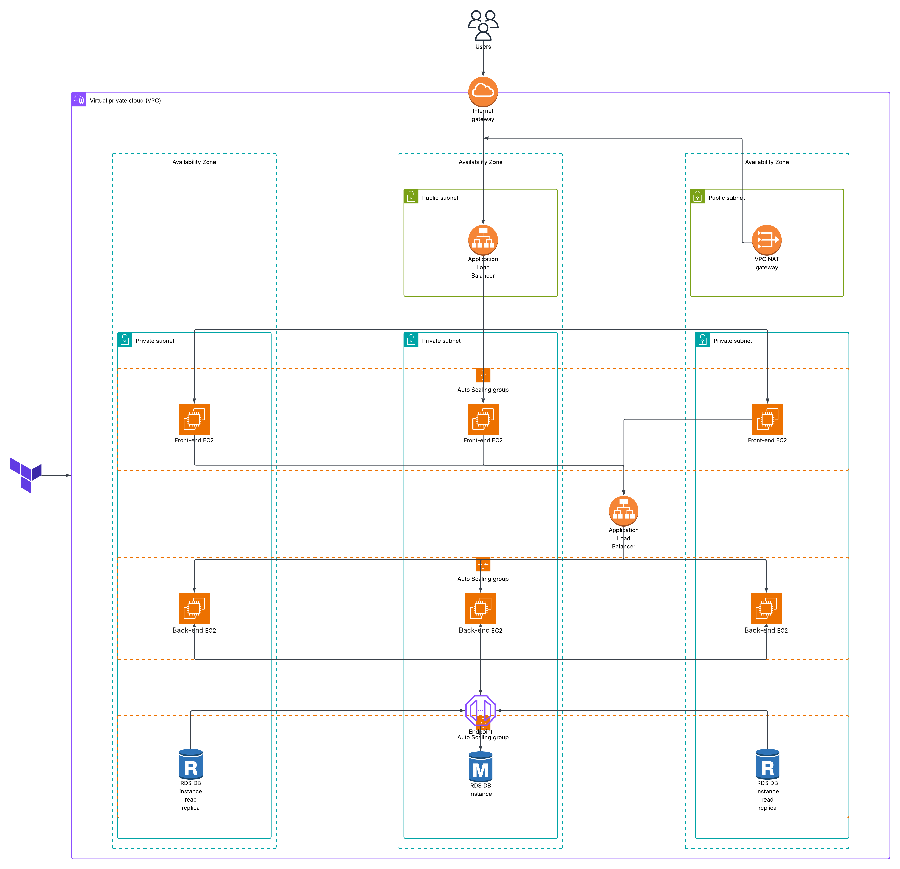

# 3-Tier AWS Application with Terraform



This project provisions a complete **3-tier architecture** on AWS using **Terraform**. It includes modular infrastructure for networking, security, compute (EC2 Auto Scaling), load balancing, and a managed MySQL database.

---

## 📁 Project Structure

├── main.tf
├── provider.tf
├── variables.tf
├── modules/
│ ├── compute/
│ ├── database/
│ ├── load-balancer/
│ ├── network/
│ └── security/


- `main.tf` – Root configuration that wires all modules together  
- `provider.tf` – AWS provider configuration  
- `variables.tf` – Input variables for the root module  
- `modules/` – Reusable modules for each infrastructure layer  

---

## 🚀 Usage

### 1. Initialize Terraform
```bash
terraform init
```

### 2. Plan and Apply
```bash
terraform plan
terraform apply
```

### 3. Destroy Infrastructure
```bash 
terraform destroy
```

## 📦 Modules Overview

- **`network`**: VPC, subnets, route tables, internet/NAT gateways  
- **`security`**: Security groups, IAM roles, instance profiles  
- **`compute`**: EC2 launch templates and Auto Scaling Groups (frontend + backend)  
- **`load-balancer`**: Application Load Balancers (ALB) for frontend and backend  
- **`database`**: RDS MySQL database with subnet group  
