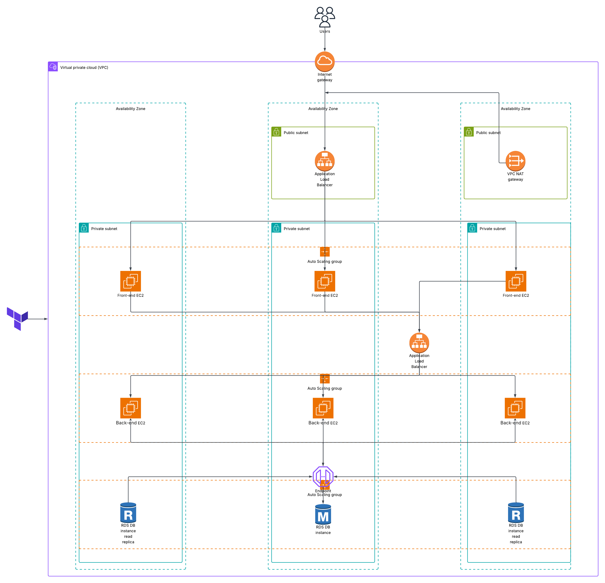

# Terraform AWS 3-Tier Infrastructure

This repository contains Terraform code to deploy a secure and scalable 3-tier architecture on AWS.

## Architecture



### Overview

This project implements a classic 3-tier web architecture using Terraform:

- **Presentation Tier** – Frontend servers in public subnets  
- **Application Tier** – Backend logic in private subnets  
- **Data Tier** – MySQL RDS database in isolated subnets  

It includes networking, security groups, NAT gateways, and all components needed for a robust infrastructure.

---

## Features

- ✅ Modular and reusable Terraform modules  
- ✅ Multiple environment support (dev, prod)  
- ✅ High availability across multiple Availability Zones  
- ✅ Secure VPC design with public, private, and isolated subnets  
- ✅ Load balancing for frontend/backend tiers  
- ✅ NAT Gateway for private subnet internet access  
- ✅ RDS MySQL with subnet group isolation  

---

## Prerequisites

- AWS account  
- Terraform v1.0+ installed  
- AWS CLI configured with credentials  
- SSH key pair to access EC2 instances  

---

## Directory Structure

```
├── main.tf                  # Main Terraform config
├── variables.tf             # Input variables
├── outputs.tf               # Outputs
├── envs/                    # Environment-specific configs
│   ├── dev/
│   │   └── terraform.tfvars
│   └── prod/
│       └── terraform.tfvars
├── modules/                 # Reusable modules
│   ├── networking/          # VPC, subnets, routes
│   ├── security/            # SGs, IAM
│   ├── compute/             # EC2, ASG, Launch Templates
│   └── database/            # RDS config
└── .gitignore
```

---

## Usage

### 1. Clone the repository

```bash
git clone https://github.com/philopateermansour/terraform-aws-3tier-infrastructure.git
cd terraform-aws-3tier-infrastructure
```

### 2. Initialize Terraform

```bash
terraform init
```

### 3. Select an environment

#### For Development

```bash
terraform workspace new dev   # Run only once if not created
terraform workspace select dev
terraform plan -var-file=envs/dev/terraform.tfvars
```

#### For Production

```bash
terraform workspace new prod  # Run only once if not created
terraform workspace select prod
terraform plan -var-file=envs/prod/terraform.tfvars
```

### 4. Apply the Infrastructure

#### Dev Environment

```bash
terraform apply -var-file=envs/dev/terraform.tfvars
```

#### Prod Environment

```bash
terraform apply -var-file=envs/prod/terraform.tfvars
```

### 5. Clean Up

#### Dev Environment

```bash
terraform destroy -var-file=envs/dev/terraform.tfvars
```

#### Prod Environment

```bash
terraform destroy -var-file=envs/prod/terraform.tfvars
```

---

## Configuration

Environment-specific configurations are stored in the `envs/` directory using `.tfvars` files for each environment.  
Customize these files to match your desired infrastructure settings.
